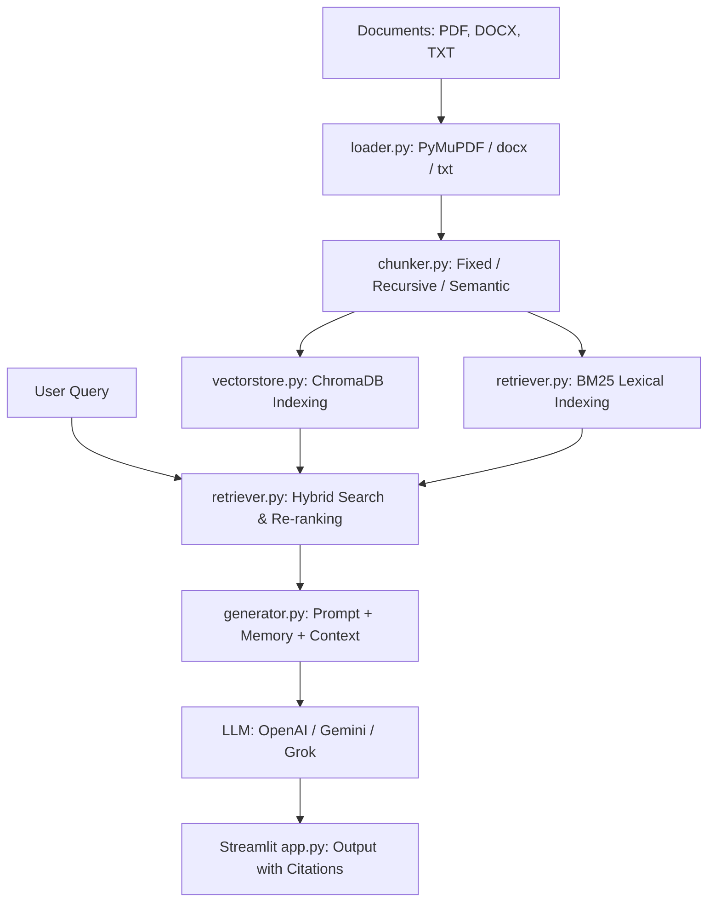

# Kortex RAG: Modular & High-Performance Knowledge Pipeline

Kortex RAG is a Retrieval-Augmented Generation (RAG) system built with **Python**, **LangChain**, and **Streamlit**. It implements advanced document preprocessing, hybrid lexical-vector retrieval, local cross-encoder re-ranking, and conversational memory with precise inline citations.

---

## ⚡ Architecture Diagram



---

## 📁 Repository Structure

```
RAGproject/
├── data/                      # Sample training/reference text documents
├── src/
│   ├── __init__.py
│   ├── config.py              # Configuration & env variable manager
│   ├── loader.py              # Document loaders (PDF, DOCX, TXT)
│   ├── chunker.py             # Chunking strategies (Fixed, Recursive, Semantic)
│   ├── vectorstore.py         # Vector database manager (ChromaDB)
│   ├── retriever.py           # Hybrid search + Re-ranking
│   ├── generator.py           # RAG chain, memory, and LLM orchestration
│   ├── evaluate.py            # Latency and response quality evaluator
│   └── index_all.py           # Pre-indexing bootstrapper
├── app.py                     # Streamlit frontend dashboard
├── requirements.txt           # Python dependencies
├── .gitignore                 # Excludes local environments and database files
└── README.md                  # System documentation
```

---

## 🚀 Setup & Execution Guide

### 1. Prerequisites & Virtual Environment
Ensure you have Python 3.10+ installed.

```powershell
# Create virtual environment
python -m venv .venv

# Activate virtual environment (Windows Powershell)
.venv\Scripts\Activate.ps1

# Install project dependencies
pip install -r requirements.txt
```

### 2. Configure Environment Variables
Create a `.env` file in the root directory (based on `.env.example`):

```env
# LLM Provider Configuration (options: gemini, openai, xai, grok)
LLM_PROVIDER=gemini

# API Keys (Provide at least the one corresponding to LLM_PROVIDER)
GEMINI_API_KEY=your_gemini_api_key_here
# OPENAI_API_KEY=your_openai_api_key_here
# XAI_API_KEY=your_grok_api_key_here

# Model Selection
LLM_MODEL=gemini-1.5-flash

# Embeddings (options: local, openai)
EMBEDDING_PROVIDER=local
EMBEDDING_MODEL=all-MiniLM-L6-v2

# Storage & Retrieval Settings
CHROMA_DB_PATH=./chroma_db
CHUNK_SIZE=1000
CHUNK_OVERLAP=200
```

### 3. Bootstrap and Index Knowledge Base
To index the sample files located in `data/` into ChromaDB:

```powershell
python src/index_all.py
```

### 4. Launch the Streamlit Frontend Dashboard
Start the Streamlit web application:

```powershell
streamlit run app.py
```

---

## 🧪 Evaluation Suite

The pipeline features a testing script that benchmarks system latency and evaluates LLM outputs for **Faithfulness**, **Relevance**, and **Correctness** using an LLM-as-a-judge system:

```powershell
python src/evaluate.py
```
*Outputs are printed to the console and written to `evaluation_report.json`.*

---

## ✨ Features Checklist
- [x] **Multi-format Ingestion:** Load PDF, DOCX, and TXT files with page-level metadata.
- [x] **Advanced Chunking:** Switch between fixed-size, structural recursive, and semantic text chunk splitting.
- [x] **Hybrid Retrieval:** Merge keyword index retrieval (BM25) and vector similarity (ChromaDB) search.
- [x] **Local Re-ranking:** Reorder retrieved passages using a Cross-Encoder model (`cross-encoder/ms-marco-MiniLM-L-6-v2`).
- [x] **Conversational Memory:** Preserve dialog context with query rewriting for follow-up questions.
- [x] **Inline Citations:** Highlight sources and exact excerpts with custom UI cards.
