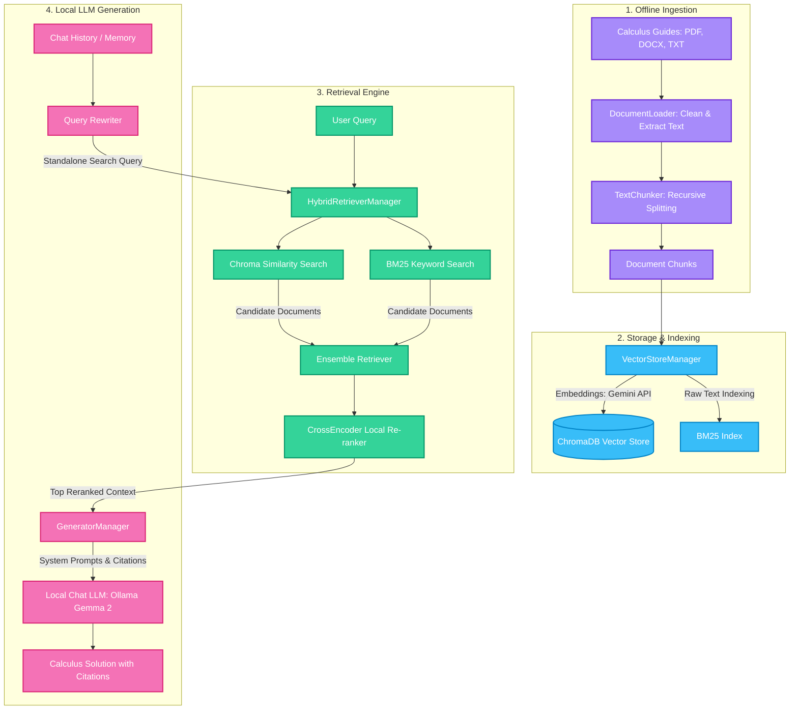

# ⚡ Local Calculus Integrals RAG Pipeline

A premium, high-performance RAG (Retrieval-Augmented Generation) pipeline running **fully locally and offline** using **Ollama** to answer and explain calculus integration questions based on a structured textbook knowledge base.

---

## 🏗️ Local System Architecture

Below is the conceptual flowchart of the local RAG pipeline:



---

## ⚡ Key Features

* **Calculus Integration Domain**: Pre-seeded with a comprehensive calculus integration guide (`data/calculus_integrals_guide.txt`) containing standard integral tables, rules, u-substitution, integration by parts, and solved examples.
* **Fully Local LLM Integration**: Orchestrated with **Ollama** to run open-source models like `gemma2:2b` or `llama3` completely offline on your own machine.
* **Database-Level Metadata Filtering**: Fine-grained queries filtered at the database level on ChromaDB and BM25.
* **Hybrid Search (keyword + vector)**: Ensemble retriever merging BM25 and ChromaDB vector search scores.
* **Streamlit UI**: Custom dashboard with glassmorphism layout, sidebar uploader, checklists, and expanding citation inspector.
* **LLM-As-A-Judge Evaluation**: Integrated benchmarking suite measuring system latency and scores (Faithfulness, Relevance, Correctness).

---

## 🚀 Local Setup & Execution Guide

### 1. Prerequisites (Ollama Installation)
1. Download and install **Ollama** for Windows from **[ollama.com](https://ollama.com)**.
2. Once installed, download the lightweight Google Gemma 2 (2.6B) model by running this command in your PowerShell or Command Prompt:
   ```powershell
   ollama pull gemma2:2b
   ```

### 2. Installation of Python Dependencies
Install the required packages in your local virtual environment:
```powershell
pip install -r requirements.txt
```

### 3. Configuration Setup
Create a `.env` file in the root directory (based on `.env.example`):
```env
LLM_PROVIDER=ollama
LLM_MODEL=gemma2:2b
EMBEDDING_PROVIDER=gemini
EMBEDDING_MODEL=models/gemini-embedding-2
GEMINI_API_KEY=your_gemini_api_key_here
```

### 4. Index Knowledge Base
Index the Calculus Integration reference files into ChromaDB:
```powershell
python -m src.index_all
```

### 5. Run Performance Benchmarks
To test response alignment and latency metrics against the Calculus integrals dataset:
```powershell
python -m src.evaluate
```

### 6. Launch the Web Application
Start the Streamlit integration solver interface:
```powershell
streamlit run app.py
```
