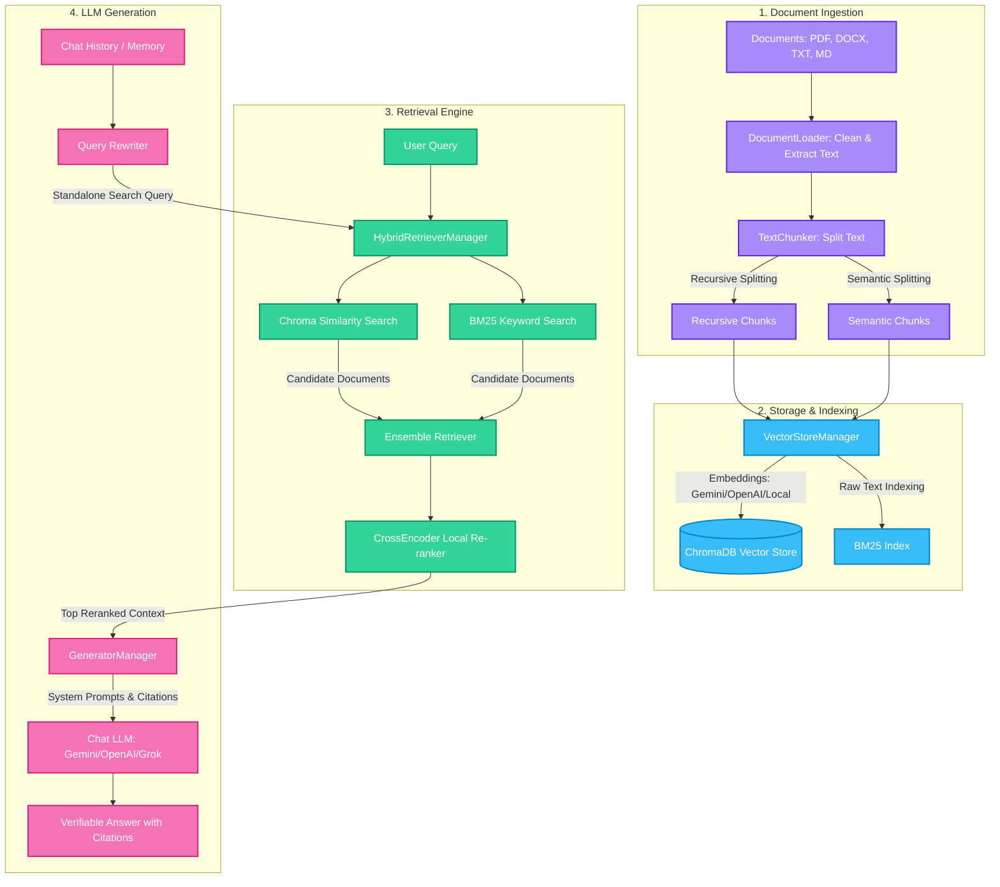

# ⚡ Kortex RAG Pipeline

Kortex RAG (Retrieval-Augmented Generation) is a premium, high-performance document intelligence pipeline designed to enable secure, conversational question answering over localized PDF, DOCX, and TXT/MD files. 

Featuring hybrid search matching (BM25 + Vector Similarity), local cross-encoder re-ranking, and strict citation-only LLM generation, it provides clear, verifiable answers directly grounded in source documentation.

---

## 🏗️ Architectural Schematic

Below is the conceptual flowchart of the Kortex RAG Pipeline:



---

## ⚡ Key Features

* **Advanced Ingestion**: Robust loaders parsing text, pages, and metadata from PDF (PyMuPDF), DOCX (python-docx), and Markdown/text files.
* **Hybrid Search (keyword + vector)**: Ensemble retriever merging BM25 and ChromaDB vector search scores.
* **Database-Level Metadata Filtering**: Fine-grained query filtering on ChromaDB and BM25 to search only within selected target documents.
* **Local Cross-Encoder Re-ranking**: Top search results are re-ordered using a sentence-transformer model (`ms-marco-MiniLM-L-6-v2`) to maximize relevance before LLM context packing.
* **Orchestration & Query Rewriting**: Utilizes conversation history to reformulate follow-up questions into standalone queries.
* **Multi-LLM Integration**: Seamlessly switch between Gemini (using LangChain Google GenAI), OpenAI, and Grok/xAI models.
* **Streamlit UI**: Premium interface with custom glassmorphism styles, dynamic filters, document upload, and expanding citation inspector.
* **LLM-As-A-Judge Evaluation**: Integrated benchmarking suite measuring system latency, Faithfulness, Relevance, and Correctness.

---

## 🚀 Getting Started

### 1. Installation
Ensure python 3.10+ is installed. Clone the repository and install the dependencies:
```bash
pip install -r requirements.txt
```

### 2. Configuration Setup
Create a `.env` file in the root directory (based on `.env.example`):
```env
LLM_PROVIDER=gemini
LLM_MODEL=gemini-2.5-flash
EMBEDDING_PROVIDER=gemini
EMBEDDING_MODEL=models/gemini-embedding-2
GEMINI_API_KEY=your_gemini_api_key_here

# For OpenAI configurations
# OPENAI_API_KEY=your_openai_key_here

# For Grok configurations
# LLM_PROVIDER=grok
# LLM_MODEL=grok-2-1212
# XAI_API_KEY=your_grok_key_here
```

### 3. Bootstrap & Index Database
Place your text, markdown, docx, or pdf documents in the `data/` directory. Run the indexing script to build your knowledge base:
```bash
python -m src.index_all
```

### 4. Run Benchmarks
Verify latency and response alignment against the pre-configured QA benchmark dataset:
```bash
python -m src.evaluate
```

### 5. Launch the Web Application
Start the Streamlit interactive dashboard:
```bash
streamlit run app.py
```
