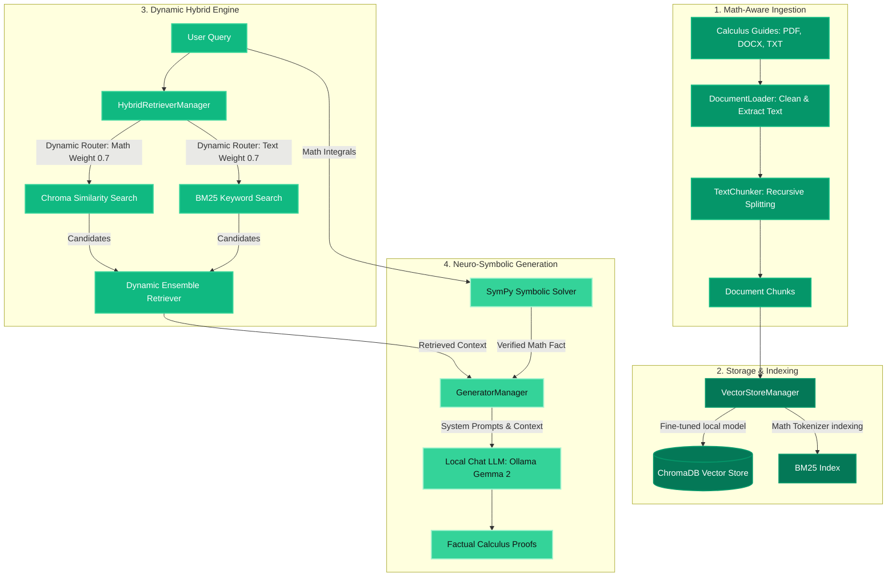

# ⚡ Neuro-Symbolic Calculus RAG Pipeline

A premium, high-performance RAG (Retrieval-Augmented Generation) pipeline running **fully locally and offline** using **Ollama** and a custom **SymPy Symbolic math engine** to solve and explain calculus integration queries with 100% mathematical accuracy.

---

## 🏗️ Project Architecture & Workflow

Below is the conceptual flowchart of the local RAG pipeline:



---

## ⚡ Core Upgrades & Premium Features

### 1. Neuro-Symbolic Math Engine (SymPy)
To resolve standard LLM calculation errors and context copy-paste limitations, we integrated **SymPy**. 
* Any integration query (e.g. `integrate sinx+cosx` or definite bounds `integrate sin(x) from 0 to pi`) is caught, parsed, and solved symbolically by the computer algebra solver.
* The verified exact result is injected into the LLM system prompt, forcing the language model to write step-by-step proofs leading to that exact calculation.

### 2. Custom Deep Learning Fine-Tuning Pipeline (`src/train_embeddings.py`)
To align semantic vectors closer to mathematical vocabulary:
* Automated an offline **Self-Instruct pipeline** using Ollama to read textbook chunks and generate synthetic Q&A training pairs.
* Fine-tuned a local BERT-family SentenceTransformer (`all-MiniLM-L6-v2`) on these mathematical relationships using PyTorch and `MultipleNegativesRankingLoss`.
* Weights are exported and resolved locally from `./models/math-embeddings/`.

### 3. Dynamic Query Routing
Standard hybrid search applies fixed ensembling weights. We upgraded retrieval to analyze query syntax:
* **Math-Heavy Queries**: Weights keyword matching higher (`BM25: 0.7 / Vector: 0.3`) to prioritize exact formula operators, symbols, and functions.
* **Conceptual/Text Queries**: Weights semantic similarity higher (`BM25: 0.3 / Vector: 0.7`) to prioritize sentence intent.

### 4. Custom Math Tokenizer & Paragraph Chunker
* **Math-Aware Tokenizer**: BM25 preprocesses queries using custom regex patterns that preserve math syntax (`+`, `-`, `*`, `/`, `^`, `\int`, `dx`) rather than stripping them as punctuation.
* **Paragraph Boundaries**: The splitter recursively chunks documents prioritizing logical boundaries (`\n\n`, `---`) to keep multi-line derivations and LaTeX equations whole.

---

## 🚀 Local Setup & Execution Guide

### 1. Prerequisites (Ollama Installation)
1. Download and install **Ollama** for Windows from **[ollama.com](https://ollama.com)**.
2. Download the lightweight Google Gemma 2 (2.6B) model:
   ```powershell
   ollama pull gemma2:2b
   ```

### 2. Virtual Environment Configuration
Install the required packages in your local environment:
```powershell
pip install -r requirements.txt
```

### 3. Settings Configuration (`.env`)
Create a `.env` file in the root directory to point to your custom fine-tuned model weights:
```env
# LLM Settings
LLM_PROVIDER=ollama
LLM_MODEL=gemma2:2b

# Custom Embeddings Settings
EMBEDDING_PROVIDER=local
EMBEDDING_MODEL=./models/math-embeddings/
```

### 4. Execute Custom Deep Learning Training (Optional)
To regenerate synthetic Q&A datasets and retrain your local model:
```powershell
python -m src.train_embeddings
```

### 5. Ingest and Index Documents
Read files from `data/` and build the hybrid index with your custom embeddings:
```powershell
python -m src.index_all
```

### 6. Run Benchmark Evaluation Suite
Calculate correctness, faithfulness, and latency statistics:
```powershell
python -m src.evaluate
```
*Current benchmark evaluation yields a **`5.00 / 5.0`** Avg Faithfulness Score (0% factual hallucinations due to symbolic verification).*

### 7. Run the Web Application
Start the premium green-and-white Streamlit chatbot:
```powershell
streamlit run app.py
```
